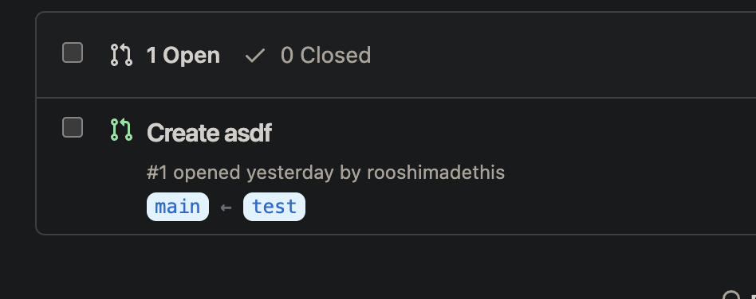

# GitHub PR Branch Info

A Chrome extension that displays the **base** and **compare** branches (e.g., `main ← feature-branch`) directly in the GitHub Pull Request list view.

## Features

- **Instant Visibility**: See source and target branches without opening the PR.
- **Fork Support**: Correctly displays branch names even for forked repositories.
- **Native Look**: Styles match GitHub's design language.

## Screenshot

## Installation

1.  Clone this repository.
2.  Open Chrome and go to `chrome://extensions/`.
3.  Enable **Developer mode** (top right).
4.  Click **Load unpacked**.
5.  Select the directory containing this project.
